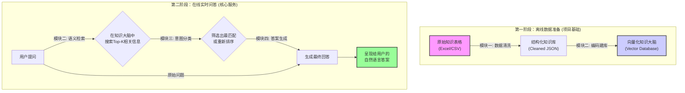

# AI 问答机器人项目流程详解

---

### 一图看懂：AI 问答机器人工作流

下图展示了从数据准备到最终回答用户的完整过程。



---

### 两大核心阶段

我们的项目可以清晰地划分为两个主要阶段：

1.  **第一阶段：离线数据与模型准备 (项目基石)**
    *   **目标**：将原始、非结构化的知识，转化为机器可以理解和高效查询的格式。这个阶段的工作是一次性的，为整个问答系统的准确性和效率奠定基础。
    *   **产出**：一个干净、标准化的知识库 (`JSON`) 和一个能够快速进行语义匹配的向量索引库 (`FAISS` + `tensors`)。

2.  **第二阶段：在线问答服务 (核心功能)**
    *   **目标**：当用户提出问题时，系统能够实时、准确地理解问题，从知识库中找到最相关的信息，并生成一个通顺、自然的回答。
    *   **流程**：`用户提问` -> `语义检索` -> `意图分类` -> `答案生成`。

---

### 四大模块详解

下面我们对每个模块的具体任务、输入输出和负责人进行详细拆解。

#### 模块一：数据预处理与知识库构建
*   **核心目标**：建立高质量、标准化的数据源。垃圾进，垃圾出，这是所有AI项目成败的第一步。
*   **负责人**：**全体成员 (第一周)**
*   **关键任务**：
    1.  **数据清洗**：处理原始表格（Excel/CSV），统一格式，去除无关信息、修正错别字、处理特殊字符。
    2.  **结构化转换**：将每一条问答知识，转换为标准的 JSON 格式。
    3.  **脚本化**：将整个过程编写为可重复执行的 Python 脚本，方便未来新增知识时自动处理。
*   **输入**：`生活专区.xlsx` 等原始表格文件。
*   **输出 (Deliverable)**：
    *   `qa_dataset_cleaned.json`：一个包含所有问答对的JSON文件。
    *   **JSON条目格式标准**：
        ```json
        {
          "id": "00123",
          "question": "如何申请公交卡？",
          "answer": "可通过公交公司官网或服务窗口直接办理。",
          "link": "https://city.gov/bus-card-application",
          "tags": ["交通出行", "卡证办理", "市政服务"]
        }
        ```

---

#### 模块二：语义向量化与检索 (Retriever)
*   **核心目标**：将文本问题转化为机器能“理解”的数学向量，并建立一个可以快速进行相似度匹配的“大脑”。这是实现语义搜索的核心。
*   **负责人**：2人
*   **关键任务**：
    1.  **问题编码**：选择一个合适的中文预训练模型（如 `bert-base-chinese`），将 `qa_dataset_cleaned.json` 中的所有 `question` 文本批量编码成高维向量 (Tensor)。
    2.  **索引构建**：使用 FAISS 或类似的高效向量检索库，为所有问题向量建立索引，实现秒级搜索。
    3.  **ID映射**：创建一个 `id` 到原始问答数据的映射表，方便从搜索结果（ID）快速回溯到完整信息。
    4.  **检索接口**：开发一个函数，接收用户的新问题，将其编码后在索引中查找最相似的 Top-K 个历史问题，并返回它们的完整信息。
*   **输入**：`qa_dataset_cleaned.json` (from 模块一)
*   **输出 (Deliverable)**：
    *   `qa_tensors.pt`：包含所有问题向量的 PyTorch 张量文件。
    *   `qa_faiss_index.index`：构建好的FAISS索引文件。
    *   `id_map.json`：问题ID到其在 `qa_dataset_cleaned.json` 中位置的映射。
    *   一个可调用的 `search(query, k)` 函数。

---

#### 模块三：意图精准分类 (Classifier/Reranker)
*   **核心目标**：在检索出的 Top-K 个结果中，进一步精准判断哪个（或哪些）是用户真正想问的问题。这是提升问答相关性的关键一步，起到“精加工”和“过滤”作用。
*   **负责人**：3人
*   **关键任务**：
    1.  **样本构造**：
        *   **正样本 (Class=1)**：将用户的查询 (Query) 与其在知识库中语义最接近的问题，构造成对，如 `(用户问题A, 库中问题A')`。
        *   **负样本 (Class=0)**：将用户查询与其不相关或相关性较低的问题，构造成对，如 `(用户问题A, 库中问题B')`。
    2.  **模型训练**：基于构造好的样本，训练一个二分类模型（例如使用 Sentence-Transformers 或微调一个BERT模型），该模型专门用于判断“查询-问题”对的匹配度。
    3.  **分类/重排接口**：开发一个函数，输入是用户问题和模块二检索到的K个候选问答，输出是经过模型打分并重排序的列表，可以筛选掉不合格的匹配。
*   **输入**：用户查询 (string) + 模块二 `search` 函数返回的 Top-K 结果。
*   **输出 (Deliverable)**：
    *   一个训练好的分类/重排模型文件。
    *   一个 `rerank(query, candidates)` 函数，返回一个经过筛选和排序的、更精确的候选列表。

---

#### 模块四：大语言模型答案生成 (Generator)
*   **核心目标**：将技术性的检索结果，转化为符合人类语言习惯的、流畅自然的最终答案。这是提升用户体验的“最后一公里”。
*   **负责人**：1-2人
*   **关键任务**：
    1.  **Prompt设计**：精心设计一个提示词（Prompt）模板。这个模板需要清晰地告诉大语言模型（LLM）它的角色、任务，以及如何利用我们提供的上下文信息。
    2.  **上下文整合**：将用户原始问题和模块三筛选出的高相关度知识（包含`question`, `answer`, `link`）动态拼接到 Prompt 模板中。
    3.  **LLM调用**：将构造好的 Prompt 发送给大模型（如 ChatGPT API 或本地部署的模型）。
    4.  **结果解析与呈现**：获取LLM返回的文本，进行适当的后处理（如提取链接），最终呈现给用户。
*   **输入**：用户的原始问题 + 模块三 `rerank` 函数返回的高质量上下文信息。
*   **输出 (Deliverable)**：
    *   一个 `generate_answer(query, context)` 函数，返回最终的自然语言回答字符串。
